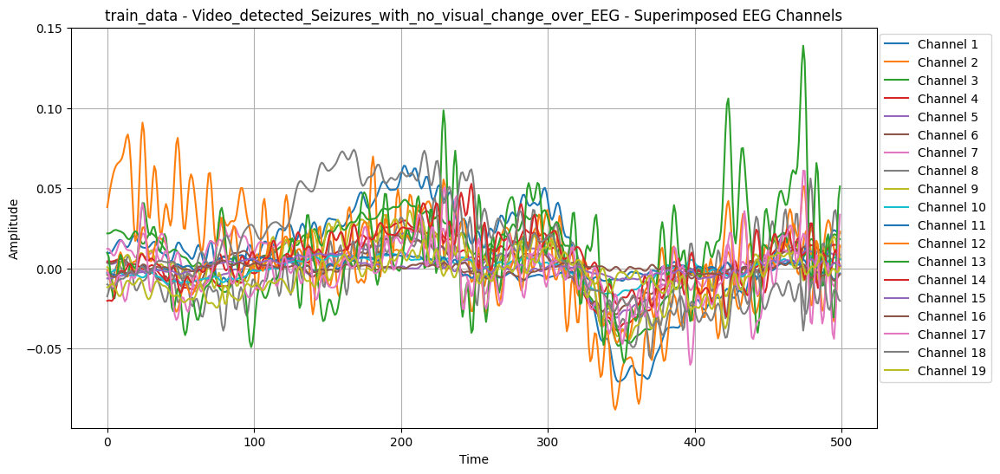
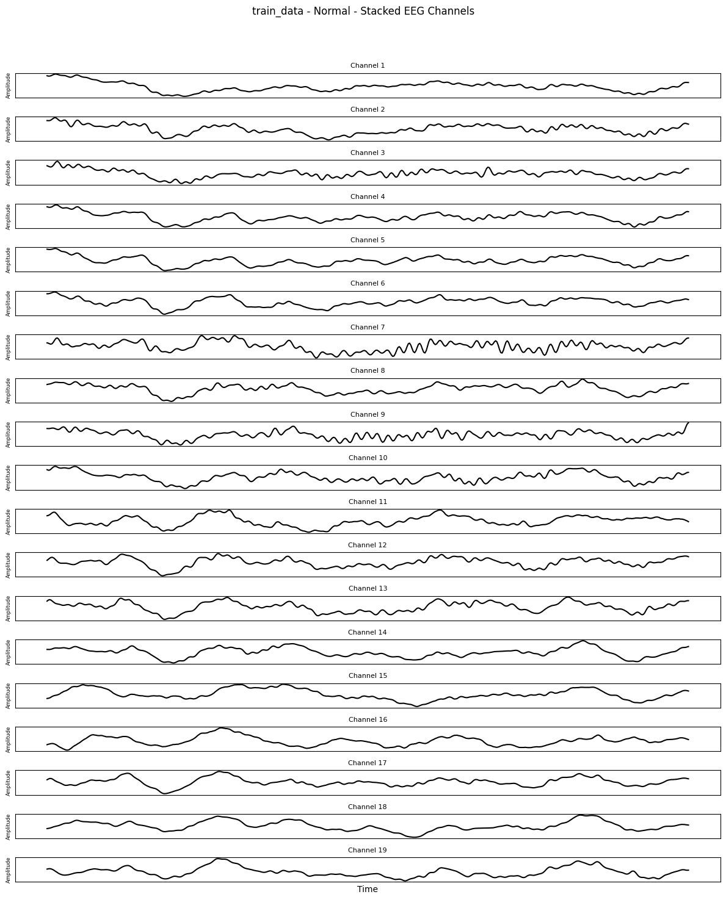
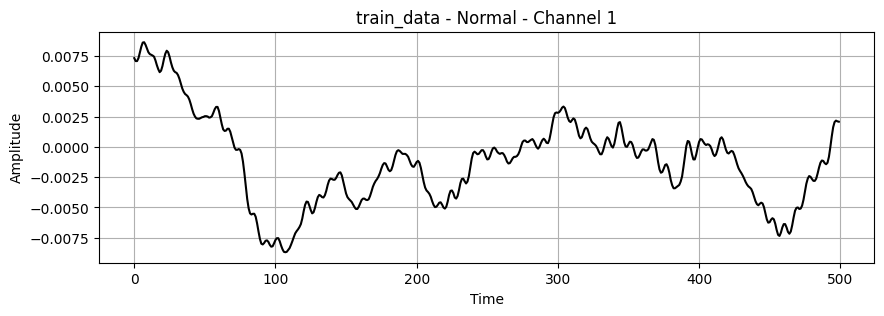
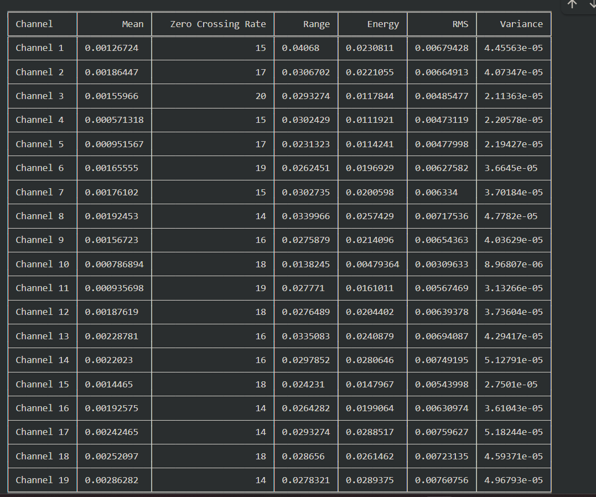
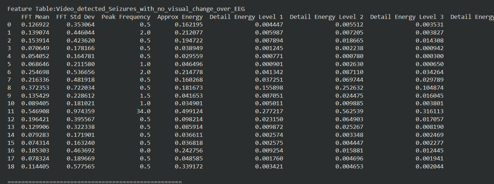
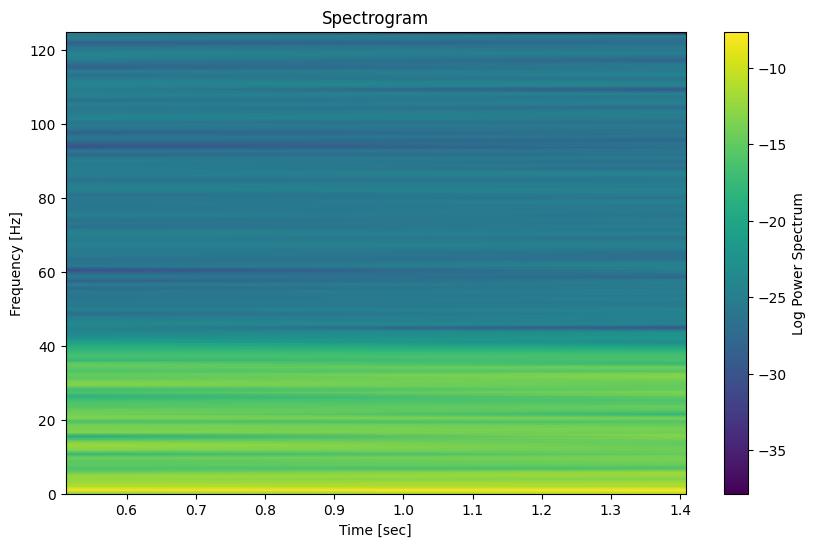
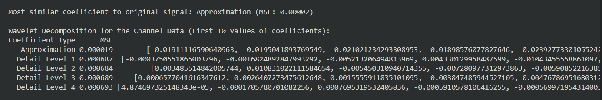

# EEG_Seizure_Classifier
EEG_Seizure_Classifier is a deep learning model that helps in classifying Seizures using Deep Learning Methods.
# Features
- ### visualizing EEG signals through 19 channels:
    - 
        - Superimposed signals from different channels 
    - 
        - Stacked signals from different channels 
    - 
        - Individual signals from different channels 
- ### Get Basic Statistical Time Domain Metrics:
    - 
        - Basic Signal Metrics
- ### Get Frequency Domain Features:
    - 
        - Features Table 
    - 
        - Spectogram each channels
    - 
        - Approximation and Detail Coefficients
- ##### Built an SVM model and trained it with training data
- ##### Built a Robust Deep Learning CNN model and trained it with
- ##### Implemented SHAP for interpretability of Model
- ##### Trained the model using denoised signals from noisy data
- ##### Implemented Generative Modeling techniques for synthetic EEG Data